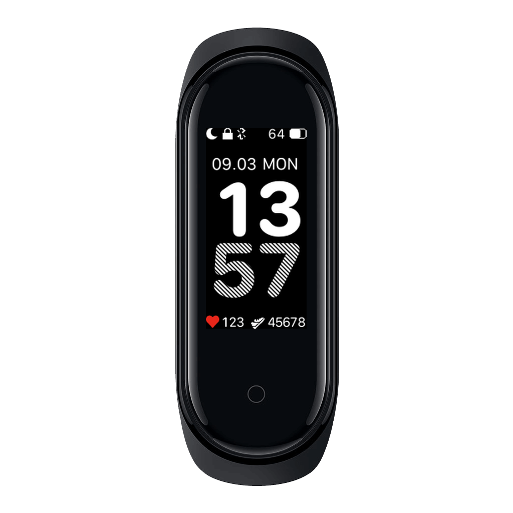
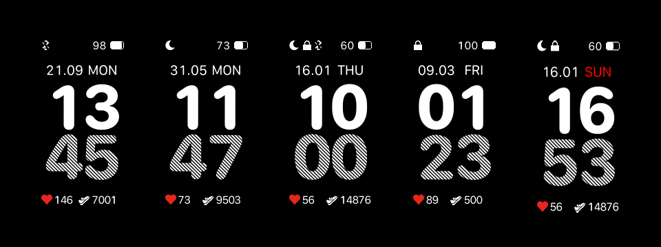

# Erl

Elegant watchface for Mi Band 4

# Development
Tools required:
- [WF_Builder](https://amazfitwatchfaces.com/mi-band-4/view/18840) (Windows only) for building actual watchface files
- [Krita](https://krita.org/en/) for editing assets and pixel-prototyping
- [SF Compact Rounded font](https://developer.apple.com/fonts/) to work with text/numbers

# Acknowledgements
This work is heavily-inspired by [Erle series of watchfaces](https://amazfitwatchfaces.com/mi-band-4/view/18840).
